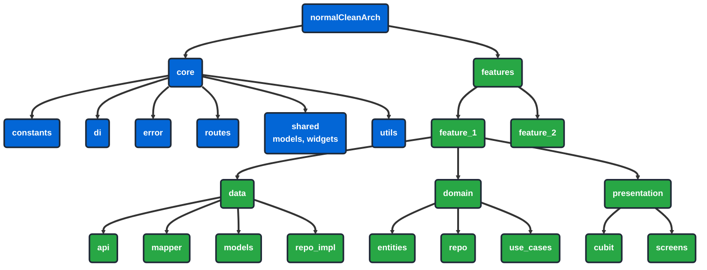

# Clean Architecture Flutter Project

Welcome to Clean Architecture Flutter Project! This is a Flutter application built following Clean Architecture principles for scalable and maintainable mobile development. It aims to demonstrate best practices in Flutter development with a modular, testable, and loosely coupled codebase structure.

## Table of Contents

- [Installation](#installation)
- [Usage](#usage)
- [Features](#features)
- [Project Structure](#project-structure)
- [Contributing](#contributing)
- [Contact](#contact)

## Installation

To get started with this project, follow these steps:

1. **Clone the repository**
   ```bash
   git clone https://github.com/your-username/clean_arch.git
   cd clean_arch
   ```

2. **Install dependencies**
   ```bash
   flutter pub get
   ```

3. **Run the application**
   ```bash
   flutter run
   ```

## Usage

This project demonstrates Clean Architecture implementation in Flutter with the following structure:

- **Core Layer**: Contains shared utilities, constants, error handling, and dependency injection
- **Features Layer**: Modular features following Clean Architecture principles
- **Presentation Layer**: UI components, screens, and state management using BLoC pattern

## Features

- ✅ **Clean Architecture**: Follows Uncle Bob's Clean Architecture principles
- ✅ **Modular Structure**: Feature-based organization for scalability
- ✅ **State Management**: BLoC pattern for predictable state management
- ✅ **Dependency Injection**: GetIt for service locator pattern
- ✅ **Network Layer**: Dio for HTTP requests with interceptors
- ✅ **Local Storage**: SharedPreferences and Secure Storage
- ✅ **Error Handling**: Comprehensive error handling and user feedback
- ✅ **Navigation**: GoRouter for declarative navigation
- ✅ **Theming**: Consistent theming and styling system

## Project Structure



This diagram illustrates the clean architecture of the `normalCleanArch` project, organized into `core`, `features`, and `lib` directories. The `features` directory includes modular components like `feature_1` and `feature_2`, each adhering to clean architecture layers.

## Contributing

We welcome contributions to this project! Here's how you can help:

1. **Fork the repository**
2. **Create a feature branch** (`git checkout -b feature/contributer-feature`)
3. **Commit your changes** (`git commit -m 'Add some contributer feature'`)
4. **Push to the branch** (`git push origin feature/contributer-feature`)
5. **Open a Pull Request**

### Development Guidelines

- Follow Clean Architecture principles
- Write tests for new features
- Update documentation as needed
- Follow the existing code style
- Ensure all tests pass before submitting

## Contact

- **Author**: Mahmoud Bakir
- **Email**: [mahmoud.m.bakir@gmail.com](mailto:mahmoud.m.bakir@gmail.com)
- **GitHub**: [@Mahm0udbakir](https://github.com/Mahm0udbakir)
- **LinkedIn**: [Mahmoud Bakir](https://www.linkedin.com/in/mahm0udbakir/)

## Built With

This section should list any major frameworks/libraries used to bootstrap your project. Leave any add-ons/plugins the acknowledgements section. Here are a few examples.

- **Flutter** - Cross-platform mobile development framework

## Top Contributors

Thanks goes to these wonderful people:

<table>
  <tr>
    <td align="center">
      <a href="https://github.com/Mahm0udbakir">
        
        <br />
        <sub><b>Mahmoud Bakir</b></sub>
      </a>
      <br />
      <a href="https://github.com/Mahm0udbakir/clean_arch/commits?author=Mahm0udbakir" title="Code">💻</a>
      <a href="https://github.com/Mahm0udbakir/clean_arch/commits?author=Mahm0udbakir" title="Documentation">📖</a>
      <a href="https://github.com/Mahm0udbakir/clean_arch/commits?author=Mahm0udbakir" title="Maintenance">🔧</a>
    </td>
  </tr>
</table>

## Support the Project

If you find this project helpful, consider supporting it:

[](https://buymeacoffee.com/mahmoudbakir)