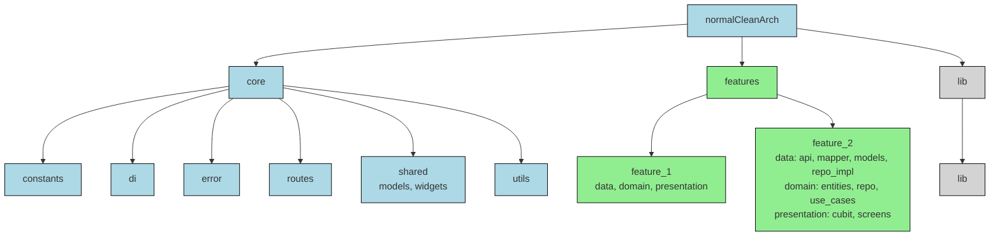

# Clean Architecture Flutter Project

## Project Structure

This diagram illustrates the clean architecture of the `normalCleanArch` project, organized into `core`, `features`, and `lib` directories. The `features` directory includes modular components like `feature_1` and `feature_2`, each adhering to clean architecture layers.

## Support the Project

If you find this project helpful, consider supporting it:

